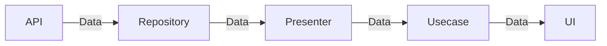

# `next.meguro.es`

## Getting Started

はじめに `.env.example` を `.env` にコピーし、管理者からトークンを受け取って貼り付けてください。

以下で <http://localhost:3000> に開発サーバーが立ち上がります。

```shell
npm ci .
npm run dev
```

ローカルで Static Site Geneation(以下、SSG) して確認する際は、以下で <http://localhost:3000> に開発サーバーが立ち上がります。

```shell
npm run build
npm run start
```

その他に有効な npm scripts は `npm run` で確認してください。

## Project Structure

[Vite](https://vitejs.dev)・[Preact](https://preactjs.com)・[Vike](https://vike.dev) によって SSG した出力を [Cloudflare Pages](https://pages.cloudflare.com) で公開しています。

以下ディレクトリの構造と簡単な説明です。

```shell
.
├── README.md
├── dist                    # ビルドの出力
├── public                  # 静的ファイル(<url>/<ファイル名>で公開されます)
└── src
    ├── components          # UIコンポーネント
    ├── hooks               # Hooks
    ├── libs                # Hooksに分類されないロジックや辞書など
    ├── pages               # ページコンポーネント
    ├── renderer            # Vike 向けファイル
    ├── styles              # スタイル
    ├── types               # 型
    └── vite-env.d.ts
```

Vike で SSG する際の決まりごとをいくつか説明します。

### `/src/renderer`

以下 `/src/renderer` の構造です。

```shell
.
├── +config.h.ts
├── +onRenderClient.tsx
└── +onRenderHtml.tsx
```

`config.h.ts` は Vike 内の値をアプリケーションで参照するためのものです。

`onRenderHtml` はサーバーサイドで実行され、`onRenderClient` はクライアントサイドで実行されます。

前者で Server Side Rendering(以下、SSR) し、後者で `hydrate` しています。どちらも `PageContext` を読み取れるので、コンテキストの内容を初期値として SSR や hydrate したい場合はここで行ってください。

`vite build` でこれらの内容が実行され、HTML ファイルとして `/dist/client` に書き出されます。

### `/src/pages`

`/src/pages` 配下にディレクトリを作成し、このディレクトリ配下に `+Page.tsx` を配置すると、ディレクトリ名に応じた HTML が生成されます。

例えば `/src/pages/foo/+Page.tsx` は `/foo/index.html` になります。

`@` から始まるディレクトリ名にすると動的に HTML を生成できます。

この際、`+Page.tsx` と同階層に `+onBeforePrerenderStart.ts` を配置し、以下のような `onBeforePrerenderStart` 関数で HTML ファイル名に対応する配列を返してください。

```ts
export async function onBeforePrerenderStart() {
    const res = await fetch("https://example.com");
    const data = await data.json();
    return data.slugs.map((slug) => `/posts/${slug}`); // e.g. /posts/foo.html /posts/bar.html
}
```

`+Page.tsx` と同階層に `+data.ts` を配置し、このファイルに以下のような `data` 関数を記述すると、サーバーサイドでデータフェッチが実行されます。

```ts
import { render } from "vike/abort";

export async function data(pageContext: PageContext) {
    const res = await fetch("https://example.com");
    const data = await data.json();
    return {
        title: data.title || "",
        description: data.description || "",
    };
}
```

`return` した内容は `PageContext["data"]` として値が保持されます。`+Page.tsx` 側で `usePageContext` を用いて取得できます。

```ts
import { usePageContext } from "~/hooks/usePageContext";

export function Page() {
  const context = usePageContext();
  return (
    <>
      <h1>{context.data.title}</h1>
    </>
  );
}
```

`return` する内容を増減させる場合、`/src/types/vike.ts` 内の `PageContext["data"]` を拡張してください。

```ts
declare global {
    export namespace Vike {
        export interface PageContext {
            /** 以下を拡張しましょう */
            data?: {
                title?: string;
                description?: string;
                ogImageUrl?: string;
                isPrivate?: boolean;
            };
            // ~~~
        }
    }
}
```

エラー時は `vike/abort` の `render` 関数で、ステータスコードとその理由を throw してください。このエラーは `/src/pages/_error` で補足されます。

```ts
import { render } from "vike/abort";

export async function data(pageContext: PageContext) {
    try {
        const res = await fetch("https://example.com");
    } catch (e) {
        throw render(500, `Something went wrong. Detail: ${e.message}`);
    }
    const data = await data.json();
    return {
        title: data.title || "",
        description: data.description || "",
    };
}
```

### `/src/libs`

このディレクトリには、Clean Architectureの一部を表現したディレクトリが含まれています。

```shell
.
├── entities        # 表示のための型定義
├── presenters      # 表示のためのクラス
├── repositories    # データをAPIや外部から取得する関数
└── usecases        # ユースケースごとに分かれた関数
```

データ取得のフローは以下になります。



データ更新は現状発生していないので、特にフローはありません。

実装は各ディレクトリ内のファイルを参考にしてください。

## Release Flow

Contentful でコンテンツを編集した後のデプロイを GUI で完結させるかつ、誤って公開することを避けるため、GitHub Actions を使用します。

Actions の [Continuous Delivery ワークフロー](https://github.com/meguroes/next.meguro.es/actions/workflows/continuous_delivery.yaml) から、 `Run Workflow` ボタンを押下します。


ブランチを `main` にセットし、ポップアップ内の `Run Workflow` を押下すると Cloudflare Pages にデプロイされます。


